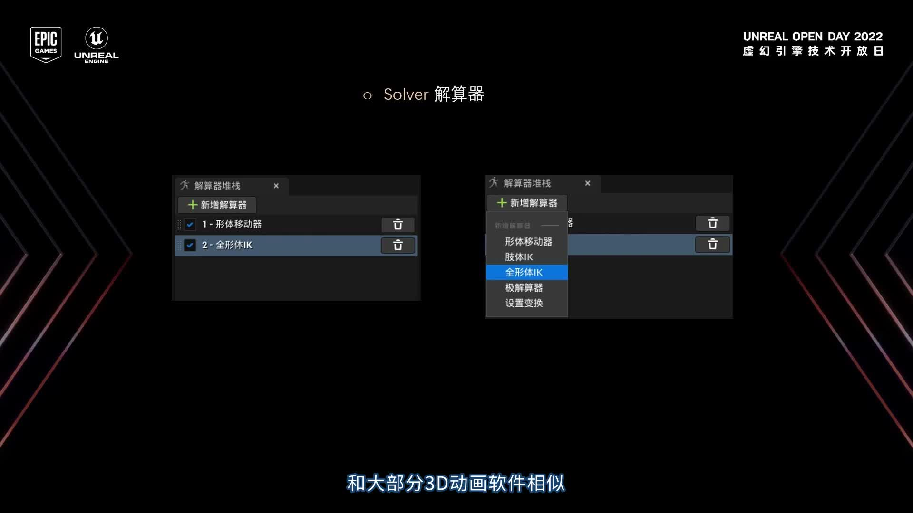

# SmartStone Blog

一个基于 [Hugo](https://gohugo.io/) 的个人技术博客项目，主要记录 C++、Unreal Engine、动画系统与工程实践相关内容。

线上地址：<https://smartstone3.github.io/>

## 封面预览



> 主题方向：UE 动画系统、IK Rig、C++ 工程实践与技术笔记。

## 文章示例

- [《IKRig的应用价值》](content/posts/ikrig-application-value.md)
  - UE5 `IK Rig` / `IK Retargeting` 的项目化落地笔记，覆盖求解器组合、动画蓝图接入与蓝图组件化应用。
- [《使用 std::variant 实现有限状态机》](content/posts/variant-fsm-cpp17.md)
  - 从枚举式 FSM 到 `std::variant` 状态机的完整迁移思路，包含代码示例与可扩展性分析。

## 技术栈

- **静态站点生成**：Hugo `0.159.2`（GitHub Actions 中使用）
- **主题**：`themes/smartstone-academic`（本地自定义主题）
- **部署**：GitHub Pages（由 GitHub Actions 自动构建与发布）

## 项目结构

```text
.
├─ archetypes/                 # 新文章模板
├─ content/
│  ├─ _index.md                # 首页文案
│  ├─ about.md                 # 关于页
│  ├─ archives.md              # 归档页
│  └─ posts/                   # 博客文章
├─ static/                     # 静态资源（图片、附件等）
├─ themes/
│  ├─ smartstone-academic/     # 当前使用主题
│  └─ PaperMod/                # 备用/参考主题
├─ hugo.toml                   # 站点配置
└─ .github/workflows/hugo.yml  # 自动部署流程
```

## 本地运行

1. 安装 Hugo（建议 Extended 版本）
2. 在项目根目录执行：

```bash
hugo server -D
```

3. 浏览器访问：<http://localhost:1313>

说明：`-D` 会包含草稿文章（`draft: true`）以便本地预览。

## 写作与发布流程

### 新建文章

```bash
hugo new content/posts/your-post-name.md
```

默认模板位于 `archetypes/default.md`，新文章初始为草稿状态。

### 发布文章

将文章 Front Matter 中的 `draft` 改为 `false` 后提交到 `main` 分支。

### 本地构建

```bash
hugo --gc --minify
```

构建结果输出到 `public/` 目录。

## 自动部署

项目包含 GitHub Actions 工作流：`.github/workflows/hugo.yml`

- 触发条件：推送到 `main` 分支或手动触发
- 主要步骤：
  - 拉取代码（含子模块）
  - 安装 Hugo `0.159.2`
  - 执行 `hugo --gc --minify`
  - 部署到 GitHub Pages

## 配置说明

主要配置文件：`hugo.toml`

- `baseURL`：站点地址
- `theme`：当前主题
- `menu.main`：顶部导航菜单
- `taxonomies`：标签等分类配置
- `params`：作者信息、首页信息与功能开关

如需调整站点标题、导航、描述等信息，优先修改该文件。

## 许可证

- 本仓库代码与内容默认遵循仓库所有者定义的许可策略。
- `themes/smartstone-academic` 主题声明为 MIT。
